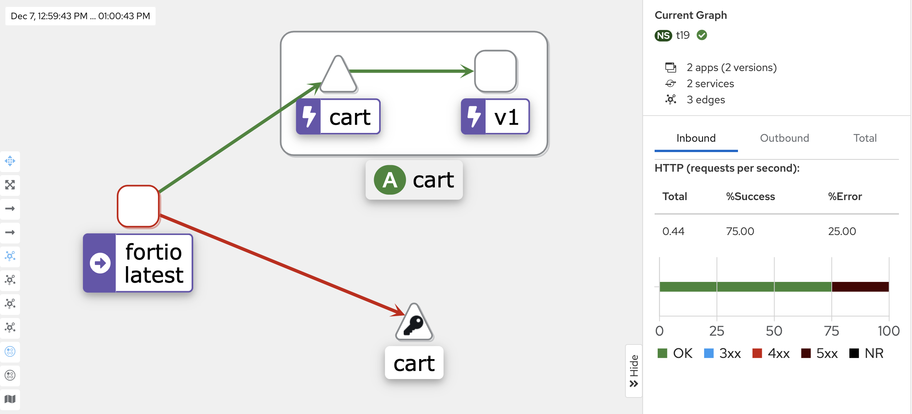
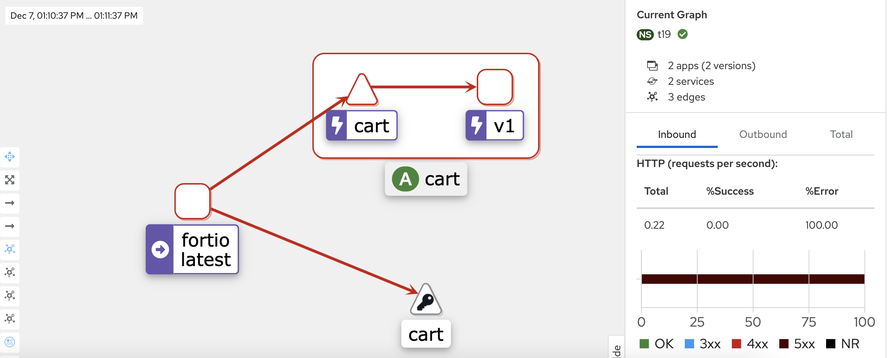

# Simulate circuit breaker with Spring Boot and Istio
This guide will show how to set up a local environment with a simple Java Spring Boot application installed
in Minikube and Istio in order see the circuit breaker mechanism with Istio.

## Prerequisites
- Java 11
- Docker and Minikube installed

## Create k8s cluster locally with Docker and minikube

Follow these steps:
- build a Docker image with Jib and push in the local register: `` ./gradlew jibDockerBuild ``
- load the image into Miikube with the command: `` minikube image load cart ``
- deploy the application in your local k8s, go to `/k8s-manifest` folder and run 
  - `` kubectl -f deployment.yaml ``
- check if everything is running with the command `` kubectl get all -n t19 ``. You should be able to see the following Kubernetes resources:
```
NAME                       READY   STATUS    RESTARTS   AGE
pod/cart-969c66977-7hfvt   2/2     Running   0          9m28s
pod/cart-969c66977-pvmtd   2/2     Running   0          9m29s

NAME           TYPE        CLUSTER-IP       EXTERNAL-IP   PORT(S)    AGE
service/cart   ClusterIP   10.100.201.143   <none>        8080/TCP   30s

NAME                   READY   UP-TO-DATE   AVAILABLE   AGE
deployment.apps/cart   2/2     2            2           9m29s

NAME                             DESIRED   CURRENT   READY   AGE
replicaset.apps/cart-969c66977   2         2         2       9m29s
```

- expose the application outside with this command: ``` kubectl port-forward service/cart 8080:8080 -n t19 ```

- run this command to test if the service is reachable from the host machine: ``curl http://localhost:8080/cart/1``. You should get an id as response, for example `"fb817981-ed77-4709-84e8-9bdcf83e2531"`

## Simulate the circuit breaker
The following scenarios show how to simulate the circuit breaking capability with Isio.

Inspiration from the Istio documentation:
- [circuit-breaking](https://istio.io/latest/docs/tasks/traffic-management/circuit-breaking/)
- [istio-workshop-circuit-breaker](https://www.istioworkshop.io/09-traffic-management/06-circuit-breaker/)

### Add the DestinationRule

Configure the circuit breaker adding the k8s custom resources Destination rule running the command: `` kubectl apply -f destinationRule.yaml ``

### Tripping the circuit breaker based on the throughput
  - Deploy Fortio with the following commands from the root folder: `` kubectl apply -f k8s-manifests/fortio-deploy.yaml -n t19 ``
  - Test if the cart service is reachable from the client:
    - ``export FORTIO_POD=$(kubectl get pods -l app=fortio -n t19 -o 'jsonpath={.items[0].metadata.name}')`` 
    - `` kubectl exec "$FORTIO_POD" -c fortio -n t19 -- /usr/bin/fortio curl -quiet http://cart:8080/cart/1 ``
  - Call the service with two concurrent connections (-c 2) and send 20 requests (-n 20):
    - ``kubectl exec "$FORTIO_POD" -c fortio -n t19 -- /usr/bin/fortio load -c 2 -qps 0 -n 20 -loglevel Warning http://cart:8080/cart/1``
  We should get some 503 errors code
    ```shell
      Code 200 : 17 (85.0 %)
      Code 503 : 3 (15.0 %)
    ````
    - Bring the number of concurrent connections up to 6:
      - ``kubectl exec "$FORTIO_POD" -c fortio -n t19 -- /usr/bin/fortio load -c 6 -qps 0 -n 30 -loglevel Warning http://cart:8080/cart/1``
        We should get a higher percentage of 503 response code
      ```shell
      Code 200 : 11 (36.7 %)
      Code 503 : 19 (63.3 %)
      ```
  - Query the istio-proxy stats to see more:
  ```shell
$ kubectl exec "$FORTIO_POD" -c istio-proxy -n t19 -- pilot-agent request GET stats | grep cart | grep pending
cluster.outbound|8000||httpbin.default.svc.cluster.local.circuit_breakers.default.remaining_pending: 1
cluster.outbound|8000||httpbin.default.svc.cluster.local.circuit_breakers.default.rq_pending_open: 0
cluster.outbound|8000||httpbin.default.svc.cluster.local.circuit_breakers.high.rq_pending_open: 0
cluster.outbound|8000||httpbin.default.svc.cluster.local.upstream_rq_pending_active: 0
cluster.outbound|8000||httpbin.default.svc.cluster.local.upstream_rq_pending_failure_eject: 0
cluster.outbound|8000||httpbin.default.svc.cluster.local.upstream_rq_pending_overflow: 21
cluster.outbound|8000||httpbin.default.svc.cluster.local.upstream_rq_pending_total: 29
```

Kiali graph




### Tripping the circuit breaker based on error (http 500)

Run the command: 
```shell
kubectl exec "$FORTIO_POD" -c fortio -n t19 -- /usr/bin/fortio load -n 10 -loglevel Warning http://cart:8080/cart/99
```

Some requests should have been ejected with 503 error code:
```shell
Code 500 : 1 (10.0 %)
Code 503 : 9 (90.0 %)
```

Kiali graph



### Other scenario

#### Connection timeout (TBD)

This scenario can be tested using the fault injection capability, injecting an artificial delay in the VirtualService Resource as explained here: [fault-injection-delay](https://istio.io/latest/docs/tasks/traffic-management/fault-injection/)
and configuring the DestinationRule resource like in the following example:

```yaml
apiVersion: networking.istio.io/v1alpha3
kind: DestinationRule
metadata:
  name: bookinfo-redis
spec:
  host: myredissrv.prod.svc.cluster.local
  trafficPolicy:
    connectionPool:
      tcp:
        maxConnections: 100
        connectTimeout: 30ms
        tcpKeepalive:
          time: 7200s
          interval: 75s
```
